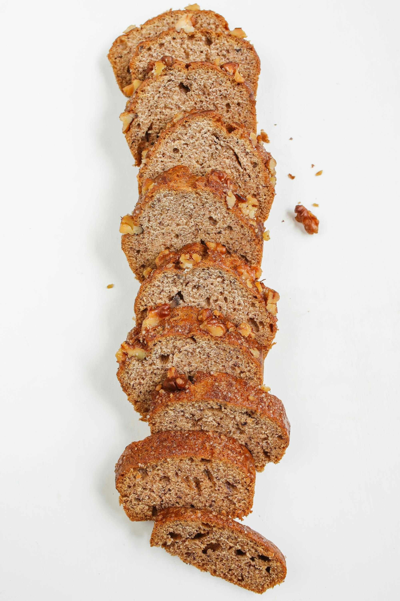
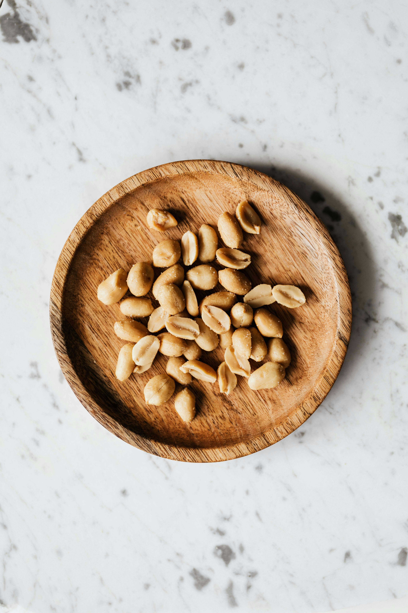
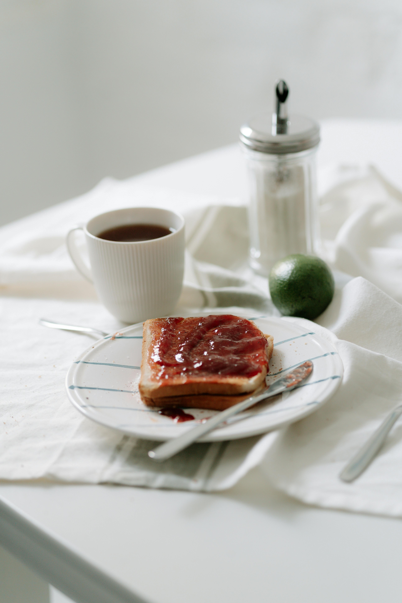

# Perfect Sandwich 

___15 minute prep time___ 

## Ingredients

* Bread

* Peanut Butter 

* Jam 

 

 ## Directions 

 1. Carefully apply peanut butter to one slice
 2. Apply jelly to the other silce 
 3. **Carefully** cut the sandwich in half (diagnolly at a 45 degree angle) 

 ## Level Up
 
 * Add bananas or chocolate syrup glaze 
